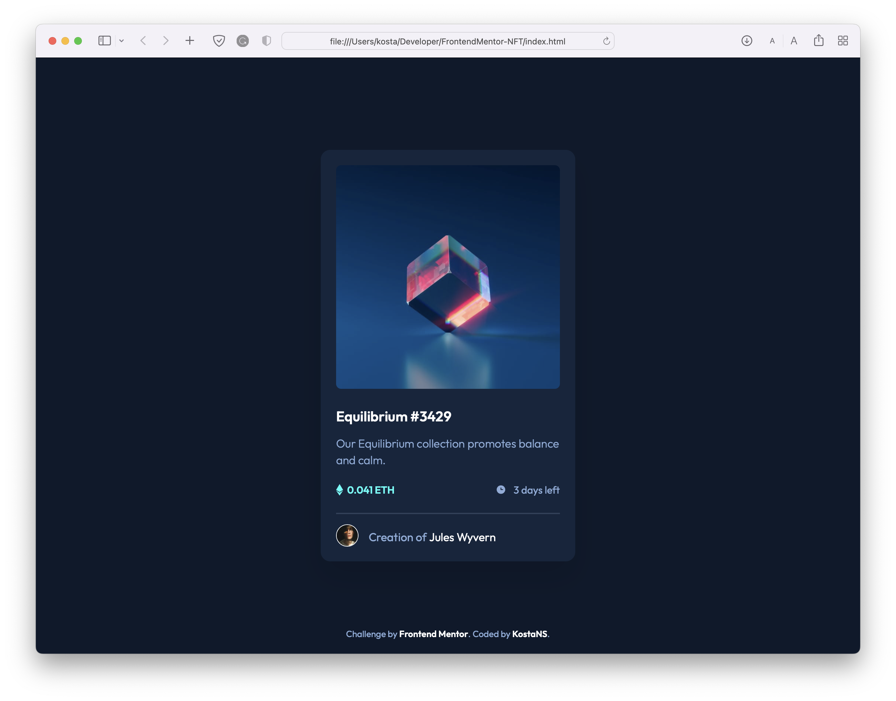

# Frontend Mentor - NFT preview card component solution

This is a solution to the [NFT preview card component challenge on Frontend Mentor](https://www.frontendmentor.io/challenges/nft-preview-card-component-SbdUL_w0U). Frontend Mentor challenges help you improve your coding skills by building realistic projects. 

## Table of contents

- [Overview](#overview)
  - [The challenge](#the-challenge)
  - [Screenshot](#screenshot)
  - [Links](#links)
- [My process](#my-process)
  - [Built with](#built-with)
- [Author](#author)

## Overview

### The challenge

Users should be able to:

- View the optimal layout depending on their device's screen size
- See hover states for interactive elements

### Screenshot

### Links

- Solution URL: [GitHub Repository](https://github.com/KostaNS/FrontendMentor-Challenge-NFT)
- Live Site URL: [GitHub Pages](https://kostans.github.io/FrontendMentor-Challenge-NFT//)

### Built with

- HTML5
- CSS3
- Flexbox
- CSS Grid

## Author

- Website - [Kosta Beric](https://www.kostaberic.rs)
- Frontend Mentor - [@KostaNS](https://www.frontendmentor.io/profile/KostaNS)
- Twitter - [@kostaberic](https://www.twitter.com/kostaberic)

